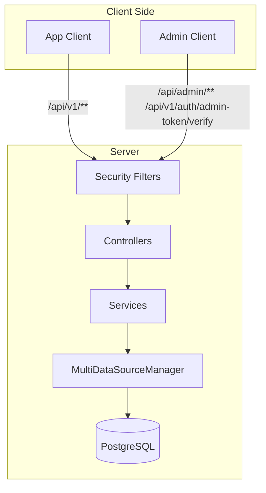
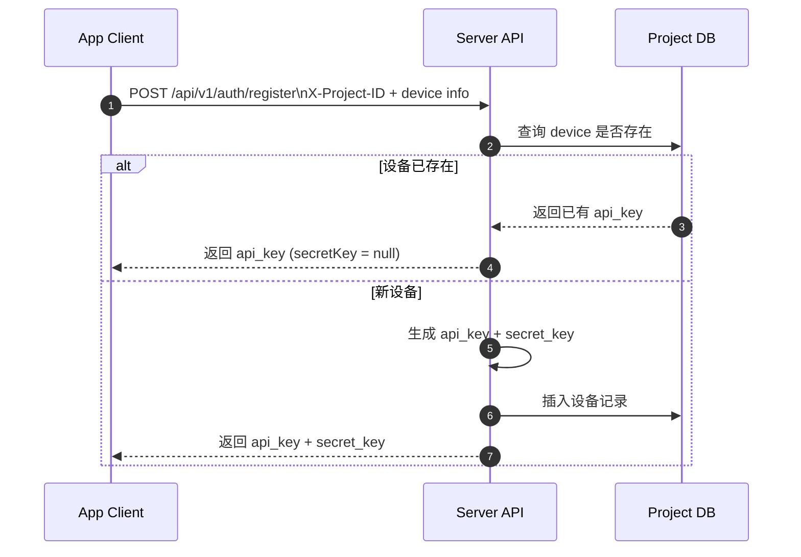
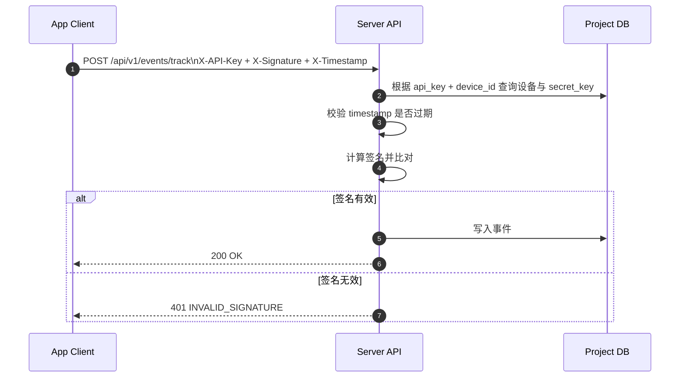
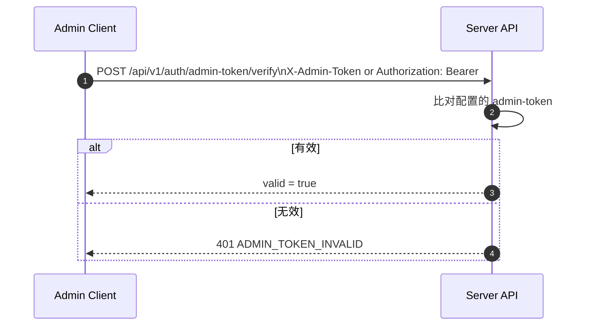
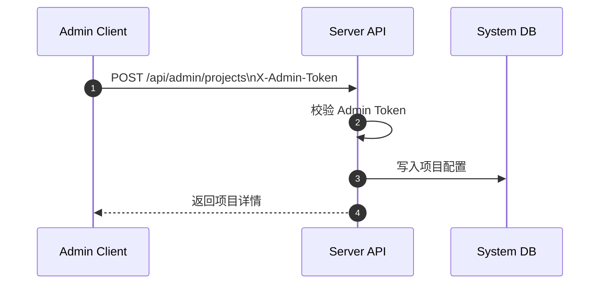

# Analytics Hub Java Backend - Architecture & Flows

本文档提供该项目的整体模块架构设计、关键认证链路，以及服务端与客户端交互时序示例。

## 目标与边界

- 目标：清晰区分采集端与管理端的接口和认证方式，便于理解整个请求流转过程。
- 边界：仅描述本仓库内服务端与客户端/管理端的交互，不覆盖前端实现细节。

## 大模块架构设计

### 逻辑模块

- API 接入层：Controller、DTO、全局异常处理
- 安全层：Admin Token 认证、**双因素认证 (2FA/TOTP)**、API Key + HMAC 认证、IP 限流防护、邮件告警、请求上下文
- 业务层：设备注册、事件采集、会话上传、流量指标采集、运营计数器、项目管理
- 数据源层：多项目数据源管理、项目配置加载、表名拼接
- 数据层：PostgreSQL + Flyway 迁移

### 运行时模块图



### 认证模块划分

- 采集端（/api/v1/**）：API Key + HMAC 签名 + 时间戳
- 管理端（/api/admin/**）：Admin Token（X-Admin-Token 或 Authorization: Bearer）
  - **安全防护**：
    - **双因素认证 (2FA)**：基于 TOTP (Google/Microsoft Authenticator)。在新环境/IP 访问时强制要求 `X-Admin-OTP` 校验。
    - **信任设备**：成功验证后 IP 加入 24 小时信任白名单，减少重复验证感。
    - **IP 限流**：5 次失败封禁 15 分钟 + 邮件告警。
- 管理端 Token 校验（/api/v1/auth/admin-token/verify）：专用校验接口
- 官网/公共入口：
  - 流量采集（/api/public/traffic/**）：无需 HMAC 签名。基于 Cookie (`ah_did`) 自动识别设备。
  - 公开汇总（GET /api/public/traffic/summary）：用于官网展示实时 PV/UV。
  - 项目识别：支持通过请求头 `X-Project-ID` 或 URL 参数 `projectId` 传递。
  - 安全：可选 `X-Traffic-Token` 校验。
  - 运营计数器（/api/public/counters/**）：支持 I18n 自动翻译与基于事件的自动化累加。只读公开计数器（isPublic=true）
- 生产环境 /actuator/**：仅在 prod profile 强制 Admin Token

## 请求处理总览

### 统一处理顺序（高层）

1. 进入 FilterChain（根据路径命中不同认证过滤器）
    - **Admin 链路**：验证 Token -> 验证 2FA (若开启且为新 IP) -> 验证通过
    - **API 链路**：验证 API Key -> 验证签名 -> 校验时间戳 -> 验证通过
2. 认证通过后进入 Controller
3. Controller 调用 Service
4. Service 通过 MultiDataSourceManager 获取项目数据源
5. 访问数据库
6. 返回统一响应结构

## 交互时序说明

### 1. 设备注册（首次）

说明：客户端首次注册拿到 API Key + Secret Key；后续请求用该 Secret Key 进行 HMAC 签名。



示例请求：

```http
POST /api/v1/auth/register
Content-Type: application/json
X-Project-ID: your-project-id

{
  "deviceId": "550e8400-e29b-41d4-a716-446655440000",
  "deviceModel": "iPhone15,2",
  "osVersion": "iOS 26.0",
  "appVersion": "1.0.0"
}
```

### 2. 事件上报（HMAC 签名）

说明：客户端用 Secret Key 对请求进行 HMAC 签名；服务端按同样规则计算并验证。



签名串格式（服务端使用）：

```
method|path|timestamp|deviceId|userId|
```

说明：为避免读取并消耗请求体，服务端不参与 body 签名；客户端应按上述格式签名。

示例请求：

```http
POST /api/v1/events/track
Content-Type: application/json
X-Project-ID: your-project-id
X-API-Key: ak_xxxxxxxxxxxxx
X-Device-ID: 550e8400-e29b-41d4-a716-446655440000
X-User-ID: 00112233445566778899aabbccddeeff
X-Timestamp: 1700000000000
X-Signature: hmac_signature_here

{
  "eventType": "button_click",
  "timestamp": 1700000000000,
  "properties": {
    "button_name": "submit"
  }
}
```

### 3. 管理端 Token 校验

说明：用于管理端登录态/Token 有效性探测。



示例请求：

```http
POST /api/v1/auth/admin-token/verify
X-Admin-Token: your_admin_token
```

### 4. 管理端项目管理

说明：管理端接口统一使用 Admin Token，不走 HMAC。



示例请求：

```http
POST /api/admin/projects
X-Admin-Token: your_admin_token
Content-Type: application/json

{
  "projectId": "new-project",
  "projectName": "New Project",
  "dbHost": "localhost",
  "dbPort": 5432,
  "dbName": "analytics",
  "dbUser": "root",
  "dbPassword": "your_password",
  "tablePrefix": "analytics_"
}
```

## 数据源与项目隔离

- MultiDataSourceManager 按 projectId 懒加载连接池
- 项目配置缓存：ProjectConfig 缓存可加速查询
- 动态表名：使用受控前缀 + 严格校验，避免标识符注入

## 常见问题

- 采集端为什么需要 HMAC？
  - 防止请求被伪造或篡改，只有持有 Secret Key 的客户端才能生成正确签名。
- 管理端为什么不用 HMAC？
  - 管理端场景更适合使用强权限 Token，与采集端请求解耦。

## 相关代码入口

- 采集端 HMAC 认证：`src/main/java/com/github/analyticshub/security/ApiAuthenticationFilter.java`
- 管理端 Token 认证：`src/main/java/com/github/analyticshub/security/AdminApiAuthenticationFilter.java`
- 管理端 Token 校验：`src/main/java/com/github/analyticshub/controller/AuthController.java`
- 多数据源管理：`src/main/java/com/github/analyticshub/config/MultiDataSourceManager.java`
